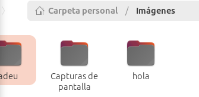
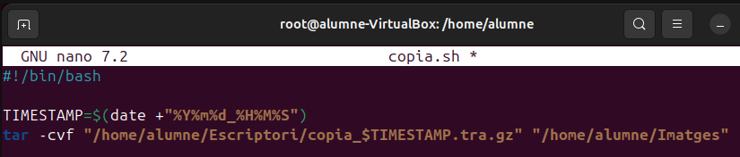
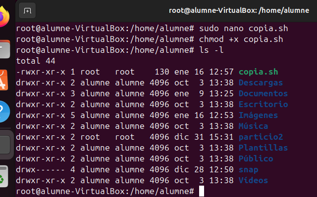
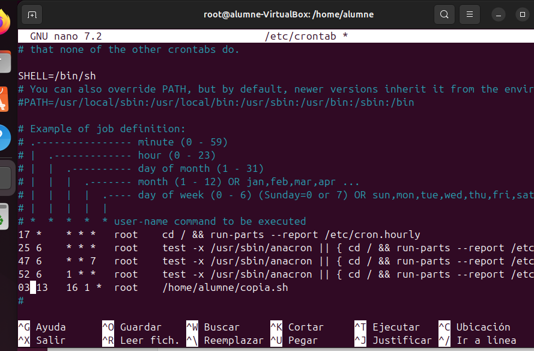
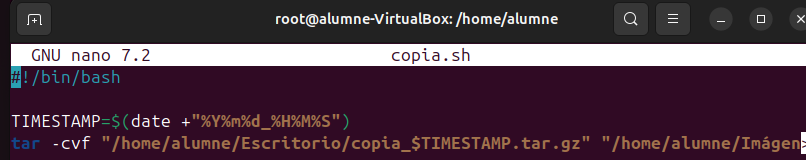
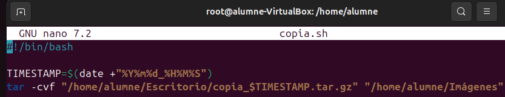
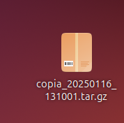
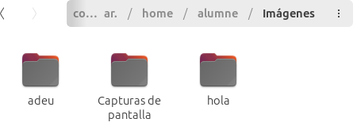
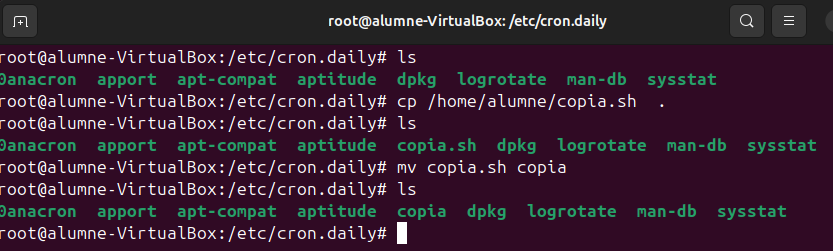

# Automatització de tasques amb cron i anacron

## Que son cron i anacron?

**cron** i **anacron** són eines utilitzades per programar l'execució automàtica de tasques al sistema. Originalment treballaven separades, però actualment poden complementar-se.

### Cron

- Dissenyat per executar tasques en un horari específic.
- Requereix que el sistema estigui en funcionament en el moment programat. Si el sistema està apagat, la tasca programada no s'executarà.
- És ideal per a tasques recurrents que necessiten ser executades de manera precisa (per exemple, cada dia a les 2:00 AM).

### Anacron

- Pensat per executar tasques que s'han de dur a terme amb una periodicitat determinada, però no importa exactament a quina hora.
- És útil en sistemes que no estan sempre en funcionament, com ordinadors personals o portàtils.
- Si una tasca programada no s'executa a causa que el sistema està apagat, **anacron** s'encarregarà d'executar-la quan el sistema torni a estar actiu.

### Quan utilitzar cron o anacron?

- **cron**:
  - Per a sistemes sempre actius (servidors).
  - Quan és necessari executar una tasca en un moment concret.
- **anacron**:
  - Per a sistemes que no estan sempre en funcionament.
  - Per a tasques generals o de manteniment que no requereixen un horari precís.

### Exemples d'ús

- Per a tasques generals i de manteniment del sistema operatiu: **anacron**.
- Per a tasques específiques d'usuaris o amb requeriments d'horari precís: **cron**.

## Configuració de cron

### Fitxer global

Les tasques que s'han d'executar per a tots els usuaris del sistema es defineixen al fitxer `/etc/crontab`.

### Exemple Practic

Primer crearem les carpetes "hola" i "hola" dins del directori d'imatges

despres crearem un script amb la funcio timestamp que creara una copia comprimida del directori /home/imatges i el guardara a l'escriptori

despres de de guardar el script utilitzarem "chmod +x " per a que que tingue permisos d'execució

despres dins de crontab configurarem que a la 1 i 3 minuts s'execute l'escript amb permisos de root

Guardem i esprem fins que aparegue el "tar" a l'escriptori

si el descomprimim podrem veure que efectivament a creat una copia del directori

dins del cron.daily copiarem el script i canviarem el nom per a que no sigui un .sh

borrem el registre que utilitza per saber que s'ha executat avui

dins del anacrontab indiquem que s'execute cada dia "1" en 1 minut

