# Unió de Clients al Domini LDAP

En aquesta secció ens encarregarem d'unir diferents clients (tant **Windows** com **Ubuntu**) al domini **LDAP**.

## Instal·lació dels Paquets Necessaris

Abans de procedir amb la instal·lació, assegureu-vos d'actualitzar el sistema amb la següent comanda:

```sudo apt update```

Ara instal·larem els paquets: ```sudo apt install libnss-ldap libpam-ldap nscd```

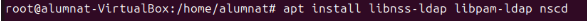

*Despres de l'instal·lacio s'brira una finestra de configuracio, si es fa algun configuracio de forma erronea o es tanca la finestra despres es pot tornar a "configurar"*.

## Reconfiguració

Ara farem la reconfiguració amb la següent comanda:

````dpkg-reconfigure lpda-auth-config```

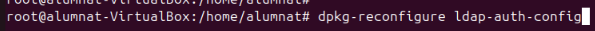

## Configuració principal

- Aqui indicarem la adrça del servidor (compte amb com esta escrit **ldap://**)

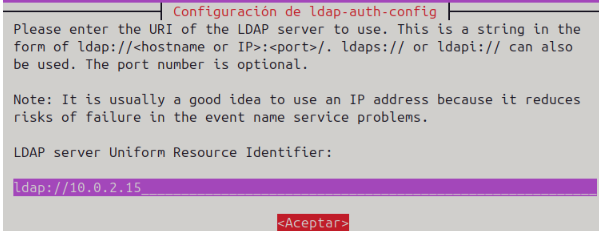

- Afegim el nom i extensió del domini

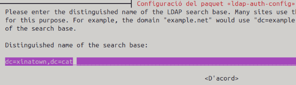

- Indiquem que la versio

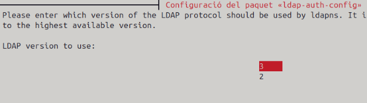

- Diem que el root local sigue administrador

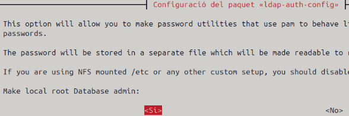

- Escollim que "si" ja que la base de dades requereix un login

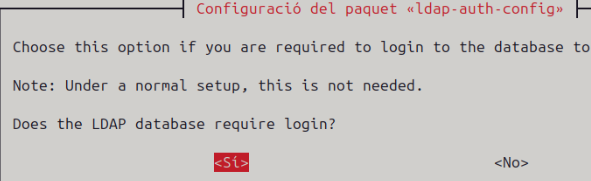

- Compte root del LDAP

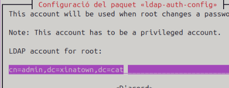

- Contrasenya del mateix compte

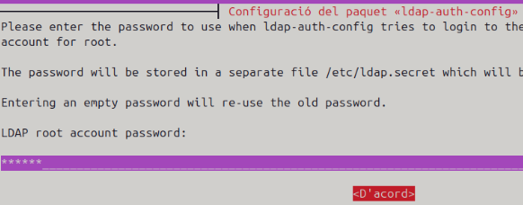

- Usuari no root

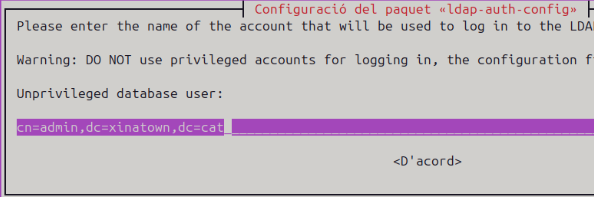

- Mateixa contrasenya

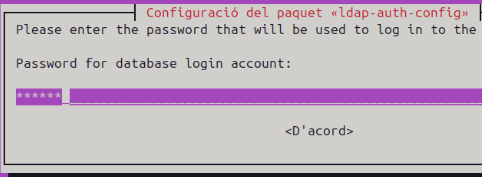

- Deixem el hash per defecte

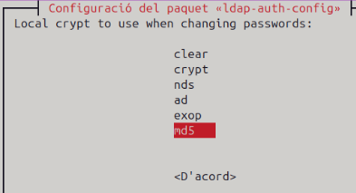

## Configuracio Addicional dels Fitxers

### Modificar */etc/nsswitch.conf*

Hi ha que afegir *"ldap compat"* devant de les 3 primeres linies (com es mostra a la següent captura)

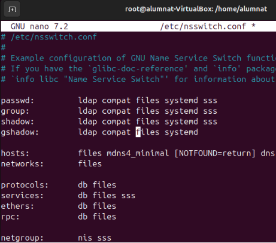

### Modificar */etc/pam.d/common-session*

Afegim la seguent linea que s'encarrega de crear automaticamen el directori de cada usuari.

```sudo nano /etc/pam.d/common-session```

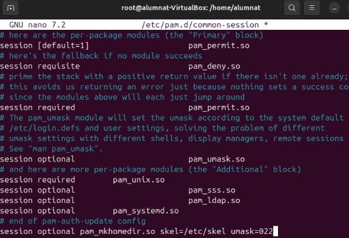

### Modificar */usr/share/lightdm/lightdm.conf.d/50-ubuntu.conf*

Aquests parametres serveixen per a evitar possibles problemes amb el login del usuari.

```sudo nano /usr/share/lightdm/lightdm.conf.d/50-ubuntu.conf```

```greeter-show-manual-login=true```

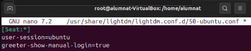

## Comprovar que s'ha unit al LDAP

Per assegurar que el sistema pot autenticar-se correctament amb LDAP, seguiu aquests passos:

### Comprovació de l'usuari amb la comanda `getent`

Executeu la comanda següent per verificar si el sistema consulta correctament l'LDAP:

```sudo getent passwd```

Si l'usuari que heu afegit, com ara `alu1`, apareix a la llista, significa que la configuració s'ha aplicat correctament i estem units al domini.

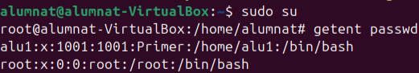

Per a comprovar que funciona al 100% reiniciem la maquina i intentem entrar a un dels usuaris del domini:

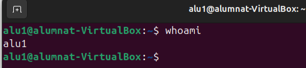

falten la meitat (revisar foto a descargues)