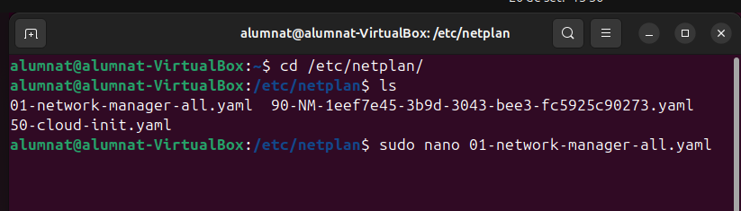
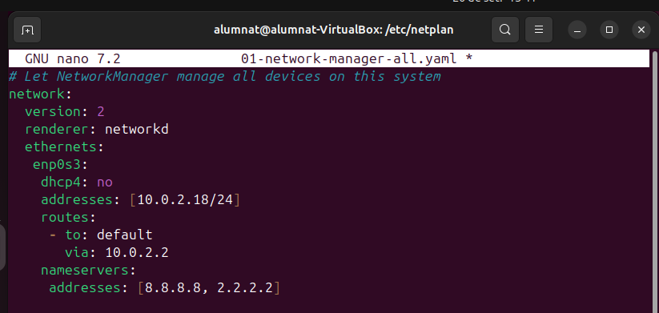
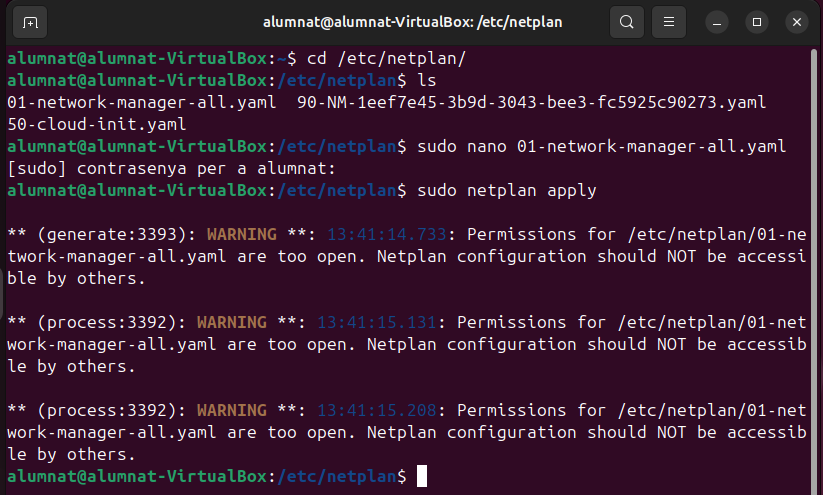

# Configuració De Xarxa (Netplan)

**Que es el timeshift?**
Timeshift és una eina de programari de còpies de seguretat i restauració per a sistemes operatius Linux, dissenyada per a crear instantànies del sistema. Aquestes instantànies capturen l'estat del sistema en un moment específic, permetent als usuaris restaurar el seu sistema a un punt anterior si alguna cosa surt malament, com una actualització fallida o una configuració incorrecta.

Instalació

Primer de tot obrim la terminal i entrem a la carpeta netplan i fem un nano del fitxer 01-network-manager-all.yaml

Despres independentment de la configuració que tinguem afegim com la de l'imatge seguent

finalment tanquem el fitxer i fem un "sudo netplan apply"

