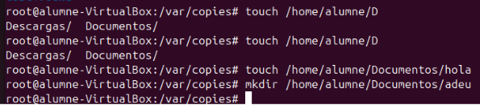
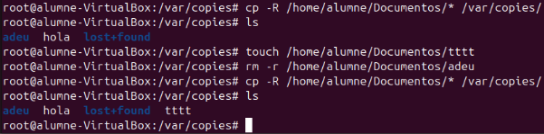
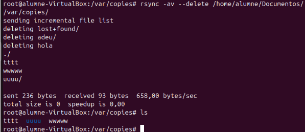
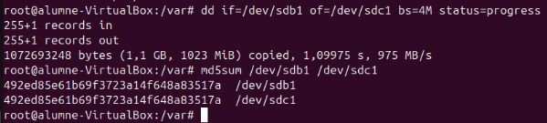

# Tipus de còpies de seguretat

## Què és una còpia incremental?

Una **còpia incremental** és un tipus de còpia de seguretat que emmagatzema únicament les dades que han canviat des de l'última còpia de seguretat (ja sigui una còpia completa o una altra còpia incremental).

### Característiques principals

- **Rapidesa**: Com que només es copien les dades noves o modificades, el procés és molt més ràpid que una còpia completa.
- **Estalvi d'espai**: Redueix l'espai necessari per emmagatzemar les còpies de seguretat.
- **Dependència d'altres còpies**: Per restaurar completament el sistema, són necessàries:
  - L'última còpia completa.
  - Totes les còpies incrementals creades posteriorment.

### Exemple de funcionament

1. **Dia 1**: Es realitza una còpia **completa** (es copien totes les dades).
2. **Dia 2**: Es fa una còpia **incremental** (es copien només les dades modificades o creades des del Dia 1).
3. **Dia 3**: Es fa una altra còpia **incremental** (es copien només les dades modificades o creades des del Dia 2).

### Diferència amb altres tipus de còpies

- **Còpia completa**: Realitza una còpia de totes les dades seleccionades, independentment de si han canviat o no.
- **Còpia diferencial**: Similar a la incremental, però copia totes les dades modificades des de l'última còpia completa (no des de l'última còpia incremental).

### Programes de còpies de seguretat (triar un programa)

#### Deja-dup

Deja-dup és una eina gràfica senzilla que permet realitzar còpies de seguretat de manera automàtica i programada. És fàcil d'utilitzar i ideal per a usuaris no tècnics.

#### Duplicity

Duplicity és un programa avançat de còpies de seguretat que ofereix xifrat, compressió i la possibilitat de treballar amb ubicacions remotes com FTP o S3. S'utilitza sovint en entorns més tècnics.

#### Altres opcions

Altres programes inclouen **Bacula**, **Amanda** i eines comercials com **Acronis** o **Veeam**.

---

### Comandes

#### Explicació i taula comparativa

| Comanda   | Tipus de còpia      | Capacitats                      | Limitacions                                  |
|-----------|---------------------|----------------------------------|---------------------------------------------|
| `cp`      | Còpia simple        | Local                           | No intel·ligent, només treballa en local.   |
| `rsync`   | Còpia intel·ligent  | Modificacions, suport remot SSH | Requereix configuració addicional.          |
| `dd`      | Clonació            | Particions, discos complets     | Treballa a nivell de bloc, no fitxers.      |

#### `cp`

La comanda **`cp`** és una eina bàsica per copiar fitxers o carpetes. És ràpida però no intel·ligent: sempre copia tot el contingut, encara que no hagi canviat, i només funciona en local.

#### `rsync`

La comanda **`rsync`** permet una còpia intel·ligent: només copia les modificacions que s'han produït des de l'última còpia. A més, ofereix suport per còpies remotes mitjançant **SSH**.

#### `dd`

La comanda **`dd`** no està dissenyada específicament per a còpies de seguretat de fitxers. S'utilitza principalment per clonar particions o discos sencers. També pot sobrescriure blocs en particions o discos per garantir la seguretat de les dades sensibles.

### Exemple Practic

Afegim un fitxer i una carpeta dins de documents

1- fem una copia de tot el contingut de documents dins del la carpeta de copies

2- comprovem que el contingut amb ls

3- afegim un fitxer nou dins de documents

4- vorem la carpeta "adeu" de documents

5- ara copiem un altre cop el contingut de documents dins de "copies" aixi demostrant que no es una comanda "inteligent"

ara amb la seguent comanda podem comprobar que rsync es "inteligent" ja que copia "actualitzant" els canvis provocats, com per exemple elimina de la copia els fitxers esborrats del directori principal

aqui utilitzant dd copiem el contingut de un disc a l'altre amb una velocitat de 4M per bloc i amb el md5sum crearem 2 hashos que si son diferents vol dir que no conte les mateixes dades als dos discs

