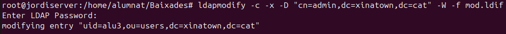
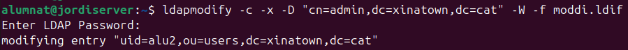

# Gestió de Directori LDAP

Aqui vorem diferens tipus de comandes **ldap** per a gestionar el nostre domini.

| Comanda     | Funció principal |
|------------|----------------|
| `ldapsearch` | Buscar informació en LDAP |
| `ldapadd` | Afegir noves entrades |
| `ldapmodify` | Modificar o afegir entrades |
| `ldapdelete` | Eliminar entrades |

## 1. ldapsearch
**La comanda `ldapsearch` permet cercar informació dins d'un directori LDAP. Alguns exemples:**

```bash
ldapsearch -xLLL -b "dc=xinatown,dc=cat" "dn cn sn mail"
```
*Busca totes les entrades i retorna `dn`, `cn`, `sn` i `mail`.* ***Exemple:***


```bash
ldapsearch -xLLL -b "dc=xinatown,dc=cat" "objectClass=posixGroup"
```
*Filtra només les entrades de tipus `posixGroup`.* ***Exemple:***


```bash
ldapsearch -xLLL -b "dc=xinatown,dc=cat" "uidNumber=1002"
```
*Cerca un usuari amb un identificador específic (`uidNumber=1002`).* ***Exemple:***


---

## 2. ldapadd
S'utilitza per afegir entrades al directori LDAP.

### Opció 1: Utilitzant `ldapadd`

Comanda:
```bash
ldapadd -c -x -D "cn=admin,dc=xinatown,dc=cat" -W -f usu.ldif
```

Fitxer **usu.ldif**:


Execució de la comanda:


### Opció 2: Utilitzant `ldapmodify`

Comanda:
```bash
ldamodify -c -x -D "cn=admin,dc=xinatown,dc=cat" -W -f mod.ldif
```

Fitxer **usu.ldif**: (Per exemple podem afegir contingut als usuaris ja creats)
```ldif
dn: uid=alu3,ou=users,dc=xinatown,dc=cat
changetype: modify
add: mail
mail: alu3@example.com
```

Execució del codi:



Amb slapcat podem vore com apareix ara el correu dins del usuari


---

## 3. ldapdelete
Es fa servir per eliminar entrades LDAP. Hi han dues maneres: una es amb ```ldapdelete``` i l'altra es aprofitar la comanda anterior ```ldapmodify``` amb un fitxer ```ldif```.

### Opció 1: Eliminació directa
```bash
ldapdelete -c -x -D "cn=admin,dc=xinatown,dc=cat" -W "uid=alu3,ou=users,dc=xinatown,dc=cat"
```
Execució del codi:


Si fem un search podrem vore que no apareix


### Opció 2: Utilitzant `ldapmodify`

Fitxer **moddel.ldif**:
```ldif
dn: uid=alu2,ou=users,dc=xinatown,dc=cat
changetype: delete
```

Comanda:
```bash
ldamodify -c -x -D "cn=admin,dc=xinatown,dc=cat" -W -f moddel.ldif
```
Execució del codi:


---

## 4. ldapmodify

### 4.1. `changetype: modify`

**Afegir un correu electrònic:**


Fem un ldap modify sobre el fitxer ```modi.ldif```

```bash
ldapmodify -c -x -D "cn=admin,dc=xinatown,dc=cat" -W -f dades.ldif
```


Fem un search per comprovar que s'ha afegit el correu


**Modificació combinada:**


Fem un ldap modify sobre el fitxer ```modi.ldif```

```bash
ldapmodify -c -x -D "cn=admin,dc=xinatown,dc=cat" -W -f dades.ldif
```



Fem un search per comprovar que s'ha afeit els nous *sn* / cognoms i que tambe s'ha eliminat el correu electronic


---

### 4.2. `changetype: modrdn`

Modificar el `cn` de l'usuari:


Fem un ldap modify sobre el fitxer ```modi.ldif```

```bash
ldapmodify -c -x -D "cn=admin,dc=xinatown,dc=cat" -W -f dades.ldif
```


Fem un search per comprovar que s'ha canviat lo *uid*


