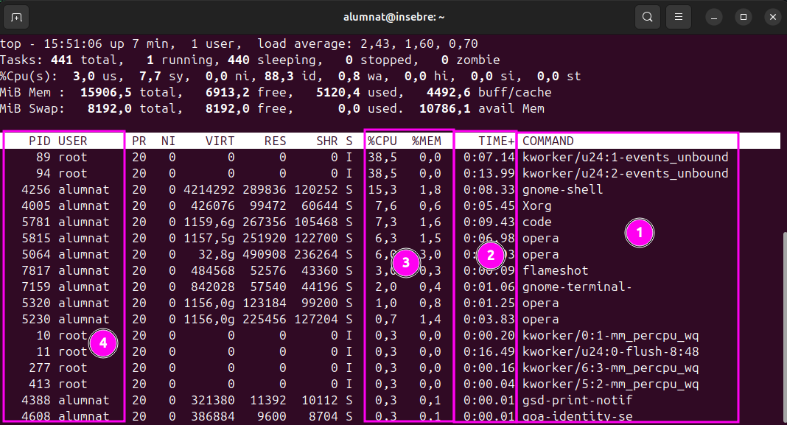
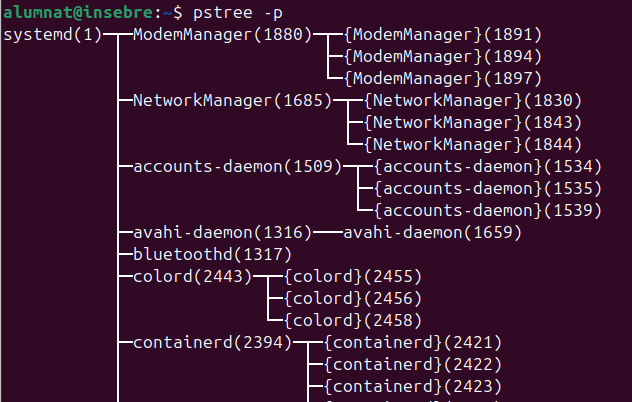
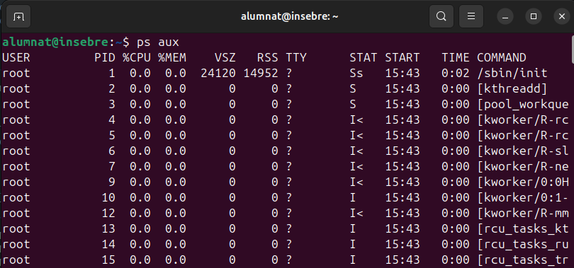
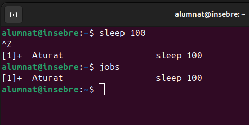
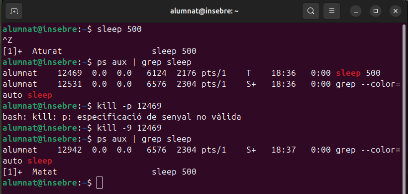

# Gestio Processos

**Que es un proces?** Una instància d'un programa en execució. Conté tota la informació necessària per executar-lo, com el codi executable, les dades, les variables, i l'estat d'execució.

- **Característiques principals:**
    - Cada procés té un PID (Process ID) únic.
    - S'executa dins d'un espai de memòria específic.
    - Es pot trobar en diferents estats: actiu, esperant, o aturat.

- **Tipus de processos:**
    - Foreground (primer pla): processos que interactuen directament amb l'usuari.
    - Background (segon pla): processos que s'executen en segon pla sense interferir amb la interfície de l'usuari.

## Comandes

- **Comanda `top`:** Serveix per monitoritzar en temps real l'estat dels processos al sistema i es mol util identificare els processos que consumeixen molts recursos.
Mostra informació com:
    - PID
    - Usuari que executa el procés
    - Percentatge de CPU i memoria que utilitza
    - Temps d'execució i estat (Running, Sleeping, etc.)
    - Començant de l'esquera a la dreta podem veure: el programari, temps actiu, el consum i finalment el numero de proces hi ha quin usuari s'esta executant.
    

- **Comanda `pstree`:** Mostra els processos en forma d'arbre jeràrquic, representant la relació entre processos pare i fills. Paràmetres importants:
    - `-p`: Mostra els PIDs juntament amb els noms dels processos.
    - `-a`: Mostra els arguments passats al procés.
    - `-u`: Mostra els noms dels usuaris que executen els processos.
    - Aqui tenim un exemple utilitzant `pstree -p`:
    

- **Comanda `ps aux`:** Mostra una llista completa dels processos al sistema amb informació detallada:
    - `a`: Inclou processos de tots els usuaris.
    - `u`: Mostra informació en format amigable per a l'usuari (com el nom del propietari).
    - `x`: Inclou processos que no tenen un terminal associat.
    - Aqui tenim un exemple utilitzant `ps aux`:
    

- **Comanda `Ctrl+C` i `Ctrl+Z`:** 
    - `Ctrl+C`: Atura un procés en execució (envia el senyal SIGINT).
    - `Ctrl+Z`: Posa un procés en pausa o segon pla (envia el senyal SIGTSTP).

- **Comanda `fg`:** 
    - Porta un procés pausat o en segon pla al primer pla.
    - Exemple:
    

- **Comanda `jobs`:** 
    - Mostra una llista dels processos que s'estan executant o estan en pausa en el terminal actual.
    - Cada procés té un número de job (ex.: `[1]`, `[2]`).
    - Exemple:
    

- **Comanda `kill -9`:** 
    - Si un procés no respon a un senyal normal (`kill PID` o `kill -15 PID`).
    - Ordena al sistema operatiu acabar immediatament amb el procés especificat, llavors hi ha que tindre compte al utilitzar-la perque pots perdre dades.
    - Exemple:
    
