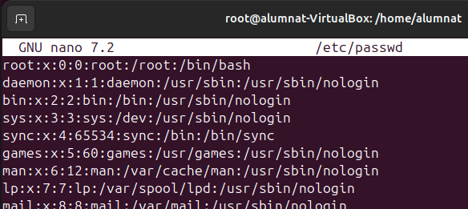
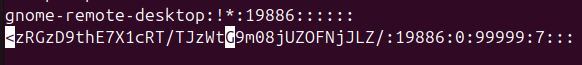
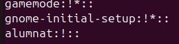
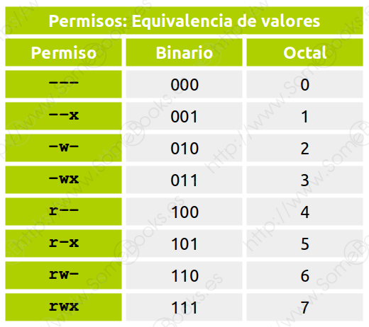

# Gestio d'Usuaris,Grups i Permisos

**Que es la PS o pseudoterminal?**

     És una interfície especial en sistemes Unix/Linux que simula el comportament d'un terminal físic per permetre que aplicacions de línia de comandes interactuïn entre elles, com si estiguessin connectades a un terminal real. Aquesta consta de dues parts el Master i el Slave. El master controla el terminal virtual, les aplicacions de control (com ssh, screen o tmux) es connecten al costat master per gestionar les dades. El slave és el costat que veu l'aplicació de l'usuari (com bash o vim), actuant com si fos un terminal real.

*Diferencies entre terminal i pseudoterminal:*

1. **Dispositiu físic vs emulació**: Els terminals solen ser dispositius físics o interfícies directes d'interacció, mentre que les pseudoterminals emulen un terminal per permetre connexions remotes o la multiplexació de sessions.

2. **Interacció entre processos**: Les pseudoterminals creen una parella de dispositius (mestre i esclau) que permet que dos processos (com el client i el servidor SSH) interactuïn, actuant el procés mestre com el terminal i el procés esclau com el programa interactiu. En un terminal físic, aquesta separació no existeix.

### Dins de la gestió d'usuaris tenim 4 fitxer molt importants

**Passwd:**

    El fitxer /etc/passwd és un fitxer del sistema Linux que conté informació bàsica sobre els usuaris registrats al sistema. Cada línia representa un usuari, i els camps estan separats per dos punts (:). Aquest fitxer està accessible per a tots els usuaris, però les contrasenyes no hi són visibles, ja que estan emmagatzemades en format xifrat al fitxer /etc/shadow.

*Descripció dels camps:*

1. **nom_usuari:** Nom de l'usuari o identificador amb el qual inicia la sessió.
2. **x:** Representa la contrasenya de l'usuari, que es troba en realitat a `/etc/shadow` per seguretat.
3. **UID (User ID):** Identificador únic de l'usuari. Els usuaris del sistema solen tenir UID baixos (per exemple, 0 per a root).
4. **GID (Group ID):** Identificador del grup principal de l'usuari, que es defineix a /etc/group.
5. **descripció:** Camp opcional que proporciona informació addicional sobre l'usuari (per exemple, el nom complet).
6. **directori_inici:** Ruta al directori personal de l'usuari.
7. **shell:** La shell per defecte que s'executarà quan l'usuari iniciï sessió (per exemple, /bin/bash).

*Exemple visual del fitxer:*

**Group:**

    El fitxer /etc/group en sistemes Linux conté informació sobre els grups definits al sistema. Cada línia representa un grup i els camps estan separats per dos punts (:), similar al fitxer /etc/passwd. Aquest fitxer és essencial per a la gestió d'usuaris, ja que defineix quins usuaris pertanyen a cada grup.

*Descripció dels camps:*

1. **nom_grup:** Nom del grup.
2. **x:** Indica que la contrasenya del grup (si n'hi ha) es troba encriptada al fitxer `/etc/gshadow`.
3. **GID (Group ID):** Identificador únic del grup.
4. **usuaris:** Llista d'usuaris que són membres addicionals d'aquest grup, separats per comes. Els membres principals del grup (aquells per als quals és el seu grup per defecte) no apareixen en aquest camp.

*Exemple visual del fitxer:*

**Shadow:**

    El fitxer /etc/shadow és un fitxer de sistema en Linux que emmagatzema les contrasenyes dels usuaris de manera xifrada i segura. Només els usuaris amb privilegis d’administrador poden accedir-hi directament, i és complementari a /etc/passwd, on es defineixen els usuaris.

*Descripció dels camps:*

1. **nom_usuari:** El nom d'usuari, que coincideix amb el del fitxer `/etc/passwd`.
2. **contrasenya:** La contrasenya xifrada de l'usuari. Si el camp conté un asterisc `*` o una exclamació `!`, l’usuari no pot iniciar sessió amb aquesta contrasenya.
3. **dia_últim_canvi:** Nombre de dies des de l’1 de gener de 1970 (època Unix) en què es va canviar la contrasenya per última vegada.
4. **dies_min:** Nombre mínim de dies que han de passar abans que l’usuari pugui canviar la contrasenya.
5. **dies_max:** Nombre màxim de dies durant els quals la contrasenya és vàlida.
6. **dies_avís:** Nombre de dies abans que caduqui la contrasenya en què es notificarà a l'usuari.
7. **dies_expira:** Nombre de dies després del qual la contrasenya caduca i l'usuari ha de canviar-la.
8. **dies_inactius:** Nombre de dies d'inactivitat després de la caducitat de la contrasenya abans que el compte sigui desactivat.
9. **data_eliminació:** Data en què el compte es desactiva, en format de dies des de l'època Unix (opcional).

*Exemple visual del fitxer:*

**Gshadow:**

    El fitxer /etc/gshadow en sistemes Linux emmagatzema informació sensible sobre els grups del sistema, incloent-hi les contrasenyes dels grups (si n'hi ha) i els permisos d'administració de grup. Aquest fitxer complementa /etc/group i només pot ser accedit per usuaris amb privilegis d'administrador.

*Descripció dels camps:*

1. **nom_grup:** Nom del grup, el mateix que es troba a `/etc/group`.
2. **contrasenya:** Contrasenya xifrada del grup. Si aquest camp conté `!`, indica que el grup no té contrasenya, i si conté un asterisc `*`, el grup està bloquejat.
3. **administradors:** Llista d'usuaris amb privilegis d'administració sobre el grup, separats per comes. Aquests usuaris poden afegir o eliminar membres del grup.
4. **membres:** Llista d'usuaris que són membres addicionals del grup, també separats per comes.

### Gnome System Tools

Si no tens GNOME System Tools instal·lat, pots instal·lar-lo des de la terminal amb el següent comandament:

    sudo apt install gnome-system-tools

*Amb genome podem utilitzar les accions mes comunes amb Usuaris i grups amb la ventatja de tenir una interficie grafica: Afegir, eliminar, modificar...Tant usuaris com grups*

## Gestio d'Usuaris

### Creacio d'Usuaris amb Ubuntu

Per a crear un nou usuari, s'utilitza la comanda "useradd seguida del nom d'usuari"

    Sudo useradd nom_usuari

*Aquesta comanda crea l'usuari, però no li assigna una contrasenya ni una carpeta d'inici. Per assignar una contrasenya:*

    Sudo passwd nom_usuari

### Modificar un usuari

Per a modificar un usuari, es pot fer servir la comanda usermod.
Algunes opcions són:

**·Afegir l'usuari:**

    Sudo usermod -aG grup nom_usuari

*Aquesta comanda afegeix l'usuari al grup especificat sense eliminar-lo d'altres grups als quals pugui pertànyer.*

**·Canviar la carpeta d'inici d'un usuari:**

    Sudo usermod -d /nou/directori nom_usuari

**·Canviar el nom d'usuari:**

    Sudo usermod -l nou_nom_usuari antic_nom_usuari

**·Canviar la contrasenya d'un usuari:**

    Sudo passwd nom_usuari

**·Eliminar un usuari:**

*Per a eliminar un usuari, utilitzem la comanda userdel. Si també volem eliminar la seva corpeta d'inici i altres fitxers associats, afegim l'opció `-r`.*

    Sudo userdel -r rom_usuari

Tambe es pot desactivar un compte sense necessitat de eliminarlo, amb el parametre -L de passwd:

    sudo passwd -L nom_usuari

Per a tornar a activar un compte utilitzem el parametre `-U`:

    sudo passwd -u nom_usuari

## Gestió de grups

Els grups són utilitzarts per a grupar usuaris i facilitar la gestió de permisos.

**·Crear un grup:**

    Sudo groupadd nom_grup

**·Afegir un usuari a un grup:**

    sudo usermod -aG nom_grup nom_usuari

**·Eliminar un grup:**

    sudo groupdel nom_grup

## Comprovació d'usuaris i grups

Per veure informació sobre un usuari o grup, es poden utilitzar les següents comandes:

**·Veure informació d'un usuari:**

    id nom_usuari

**·Veure la llista d'usuaris del sistema:**

    cat /etc/passwd

**·Veure els grups d'un usuari:**
    groups nom_usuari

## Gestió de permisos

Els permisos d'accés als arxius i directoris es gestionen mitjançant les comandes: chmod, chown i chgrp.

*Exemple visual de la gestió de permisos:*

**·Canviar els permisos d'un arxiu o directori(chmod):**
Els permisos es poden expressar en forma numèrica `(r=4, w=2, x=1)` o simbòlica.

Per exemple, per donar permisos de lectura, escriptura i execució al propietari, i només de lectura i execució als altres:

    Sudo chmod 755 fitxer

O bé de forma simbòlica:

    Sudo chmod u=rwx, go=rx fitxer

**·Caviar el propietari d'un arxiu o directori(chown):**

    Sudo chown nou_propietari fitxer

Per canviar tant el propietari com el grup:

    Sudo choen nou_propietari:nou:grup fitxer

**·Canviar el grup d'un arxiu o directori(chgrp):**

    Sudo chgrp nou_grup fitxer

