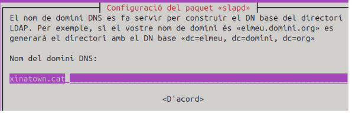
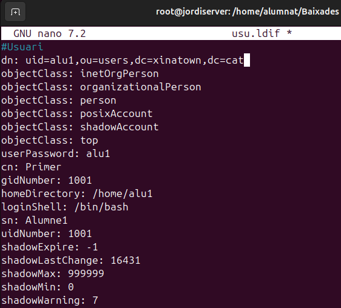

# Instal·lació i preparació d'un domini ldap

## Que es?

Un domini **LDAP** (*Lightweight Directory Access Protocol*) és una estructura jeràrquica utilitzada per organitzar i gestionar informació en un directori. LDAP és un protocol estàndard que permet accedir i mantenir serveis de directori distribuïts sobre una xarxa IP. Un domini LDAP es refereix a un conjunt d'objectes (com usuaris, grups, dispositius, etc.) organitzats en una estructura d'arbre, on cada node representa una entrada al directori.

### Característiques principals

1. **Estructura jeràrquica**:  
   Les dades s'organitzen en una estructura d'arbre, similar a un sistema de fitxers. Cada entrada a l'arbre té un nom únic (**DN**, *Distinguished Name*) que indica la seva ubicació a la jerarquia.

2. **Entrades i atributs**:  
   Cada objecte al domini LDAP té atributs que emmagatzemen informació específica. Per exemple, un usuari pot tenir atributs com:
   - `cn` (*common name*)
   - `sn` (*surname*)
   - `mail`

3. **Cerques eficients**:  
   LDAP està optimitzat per operacions de lectura i cerca, cosa que el fa ideal per consultes freqüents sobre dades de directori.

4. **Autenticació i autorització**:  
   S'utilitza habitualment per autenticar usuaris i gestionar permisos en sistemes i aplicacions.

### Exemple d'ús

Un domini LDAP és comú en entorns empresarials per gestionar:

- **Usuaris i contrasenyes**: Autenticació centralitzada a xarxes.
- **Recursos compartits**: Accés a impressores, servidors i altres dispositius.
- **Aplicacions**: Integració amb sistemes com correu electrònic, VPN, etc.

### Exemple d'estructura LDAP


### Comandes i ferramentes

#### **Slapcat**

Utilitzat per exportar dades del directori LDAP. Si no mostra el domini, cal verificar la configuració i el contingut inicial del directori. Pot ser necessari reinicialitzar o afegir dades correctes.

#### **Archius ldif**

Els fitxers LDIF (LDAP Data Interchange Format) defineixen objectes per al directori.

- La primera línia d'un fitxer LDIF és la referència DN (Distinguished Name), que identifica de manera única l'objecte al directori.

##

## Configuració inicial

Primer de tot instroduirem una ip a domini de forma estatica ja que es recomanable per als servidors tenir una ip fixa


Despres afegim el hostname.


I despres afegim a hosts el hostname complet del servidor.


*Reiniciem l'equip*.

A la preparació feta passem a instal·lar els paquest necessaris que son: **ldap-utils** i **slapd**.

- **ldap-utils**: Són les eines necessaries per a modificar les dades del servidor.

- **slapd**: Es el servidor ldap

```sudo apt install slapd ldap-utils```

*recomanem dir que si a tot lo del menu per a verificar que s'ha instal·lat correctament amb "slapcat"*.

## **Reconfiguració amb** ```dpkg-reconfigure slapd```

*Despres fem un reconfigure i ara si introduim la informacio que volem del servidor.*

- Primer de tot direm que "no" volem ometre la configuració.


- Despres introduim el nom de domini que hem configurat el ```etc/hosts```.



- Introduim la contrasenya que volem utilitzar per a l'administrador del vervidor ldap.


- Indiquem que si volem eliminar la base de dades quan esborrem el paquet slapd.


- Indiquem que si volem que es mogue la base de dades antiga en cas de que hi hagi una.


- Verifiquem amb slapcat que s'ha configurat correctament


### **Fitxers LDIF**

Els fitxers amb extensió .ldif (LDAP Data Interchange Format) s'utilitzen per definir i importar dades al servidor LDAP. Aquests fitxers permeten configurar elements com unitats organitzatives, usuaris, grups i altres estructures.

En aquest exemple, hem creat un fitxer `uo.ldif` per afegir una Unitat Organitzativa (OU) anomenada `users`. Els elements definits inclouen:

- **dn** (Distinguished Name): Identifica de manera única l'objecte al directori LDAP.
- **objectClass**: Defineix el tipus d'objecte (en aquest cas, una unitat organitzativa).
- **ou**: Nom de la unitat organitzativa (`users`).

Aquest fitxer serà utilitzat per carregar la configuració al servidor LDAP mitjançant comandes com `ldapadd`.


#### Fitxer ```grup.ldif```

### Creació del fitxer `grup.ldif`

El fitxer `grup.ldif` defineix un grup dins del nostre servidor LDAP. Aquest grup serà associat a una Unitat Organitzativa (OU) ja existent (en aquest cas, `users`). Aquí detallem els paràmetres utilitzats:

- **dn** (Distinguished Name): Identifica de manera única el grup (`cn=alumnes,ou=users,dc=vitaliy,dc=com`).
- **objectClass**: Defineix el tipus d'objecte (en aquest cas, `posixGroup`, per a grups POSIX).
- **cn**: Nom del grup (`alumnes`).
- **gidNumber**: Identificador únic del grup (`1001`).
- **memberUid**: Usuaris membres del grup (en aquest cas, `alu1`).

Aquest sera per a crear grups mitjançant ldapadd.


#### Fitxer ```usu.ldif```

### Creació del fitxer `usu.ldif`

El fitxer `usu.ldif` defineix un usuari dins del nostre servidor LDAP. Aquest fitxer bàsic conté els paràmetres essencials per crear un compte d’usuari, però es pot ampliar amb més informació com correu electrònic, número de telèfon, etc.

#### Paràmetres utilitzats:

- **dn** (Distinguished Name): Identifica de manera única l’usuari (`uid=alu1,ou=users,dc=vitaliy,dc=com`).
- **objectClass**: Defineix les classes que caracteritzen l’usuari, com:
  - `inetOrgPerson` i `organizationalPerson` per a informació personal i organitzativa.
  - `posixAccount` i `shadowAccount` per compatibilitat amb sistemes POSIX i gestió de contrasenyes.
- **userPassword**: La contrasenya de l’usuari (`alu1`). És recomanable que estigui en format encriptat.
- **cn**: Nom comú de l’usuari (`Primer`).
- **sn**: Cognom de l’usuari (`Alumne1`).
- **gidNumber**: Grup al qual pertany l’usuari (`1001`).
- **uidNumber**: Identificador únic de l’usuari (`1001`).
- **homeDirectory**: Directori personal de l’usuari (`/home/alu1`).
- **loginShell**: Shell predeterminada de l’usuari (`/bin/bash`).
- **shadowExpire, shadowLastChange, shadowMax, shadowMin, shadowWarning**: Paràmetres relacionats amb la caducitat i avisos de contrasenyes.

Aquest fitxer es pot utilitzar per crear l’usuari dins de l’organització definida al directori LDAP. És possible afegir més atributs segons les necessitats, com ara correu electrònic, telèfon o ubicació.



### Pujar els fitxers al servidor LDAP

Un cop creats els fitxers `.ldif`, hem de carregar-los al servidor LDAP perquè els objectes (unitats organitzatives, grups i usuaris) es creïn dins del directori.

Això es fa mitjançant la comanda `ldapadd`, que permet afegir dades al servidor LDAP. La sintaxi és la següent:

### Comanda i parametres:

```ldapadd -c -x -D "cn=admin,dc=vitaliy,dc=com" -W -f <nom_fitxer>```

- **-c**: Continua amb els altres fitxers, encara que hi hagi errors en algun dels fitxers processats.
- **-x**: Utilitza autenticació simple, sense mecanismes d'autenticació addicionals.
- **-D**: Especifica el Distinguished Name (DN) de l'usuari administrador. Exemple: `cn=admin,dc=vitaliy,dc=com`.
- **-W**: Demana la contrasenya de l'usuari administrador abans d'executar la comanda.
- **-f**: Indica el nom del fitxer `.ldif` que es vol carregar.

## Exemple de comanda per pujar un fitxer LDIF

Per pujar el fitxer `uo.ldif`, podem executar la següent comanda:

**Comanda utilitzada:**
```ldapadd -c -x -D "cn=admin,dc=vitaliy,dc=com" -W -f uo.ldif```


## Ldap ubuntu sense *GUI*

L'unic diferent es que tindrem que configurar l'adaptador de xarxa per a configurar una adreça ip estatica.

entrem amb nano al netplan

```sudo nano /etc/netplan/50-cloud-init.yaml```


Subtituim el mode dhcp per les direcciones ip i DNS estàtiques.


