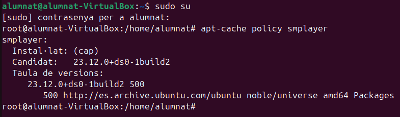
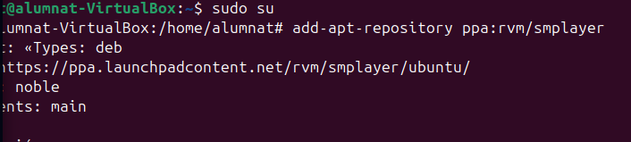
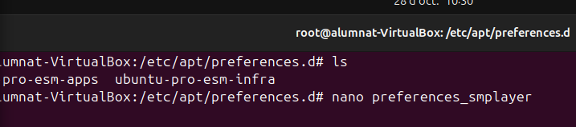
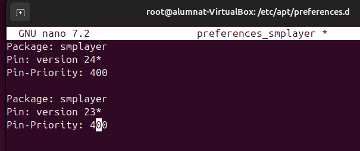
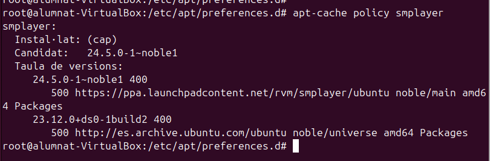
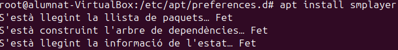
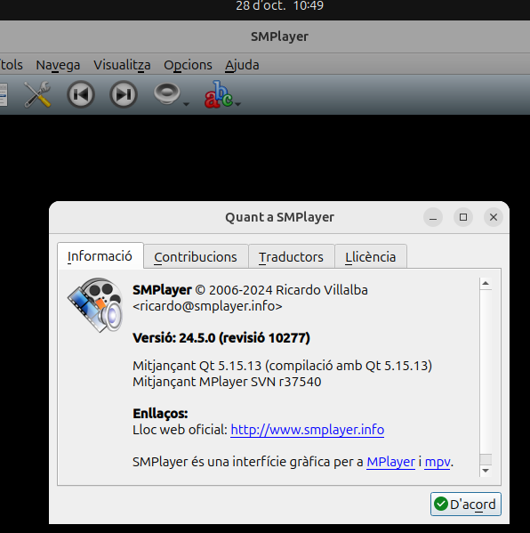

# Afegir repositoris manualment

**Que es apt-cache?**

    -És una eina a la línia de comandes en sistemes basats en Debian (com Ubuntu) que permet buscar i obtenir informació sobre els paquets disponibles als repositoris configurats. S'utilitza principalment per explorar el contingut de la base de dades de paquets sense fer cap instal·lació o modificació al sistema.

**Que es apt-repository?**

    -L'argument repository s’utilitza per afegir, modificar o gestionar repositoris de programari a un sistema basat en Debian, com Ubuntu.

Per a revisar manualment els paquets que tenim d'un programari utilitzem la seguent comanda a la terminal:

    apt-cache policy

Despres per a poder afegir un repositori manualment utilitzarem el add-repository:

    add-apt-repository

Despres tindrem que crear un fitxer nou (en aquest cas preferences_smplayer) dins del repository afegit previament, entrarem amb cd al directori i despres utilitzarem un "sudo nano" per a crear el fitxer nou:

    sudo nano preferences_smplayer

    Package: smplayer
    Pin: version 24*
    Pin-Priority: 400
    
    Package: smplayer
    Pin version 23*
    Pin-Priority: 400

Podem utilitzar un altre cop apt-cache per a comprovar que s'ha actualitzar els repositoris que tenim afegits a smplayer

Finalment una vegada estem segurt de que tenim els packets necessaris o que nosaltre volem, instalem el smplayer

    apt install smplayer

I comprovem que la versió del programari es la desitjada

