# Creació, formateig, muntatge i compartició de particions

Aquest sector sera completament amb exemples practics!

## Creació

entrem amb mode administrador i amb fdisk -l comprovem l'estat del disk sdb i configurem una nova partició

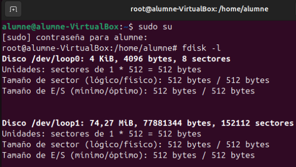

comprovem l’estat del disc sdb i configurem una nova partició

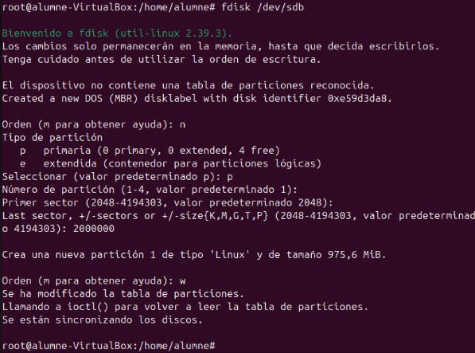

amb fdisk -l podem veure informacio detallada del disc

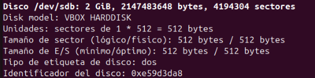

l'hi assignem un format a la particio previament creada utilitzant mkfs.ext4 (indicant el tamañi dels blocs)

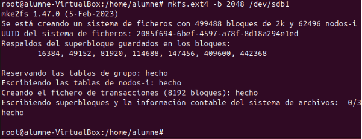

utilitzem tune2fs amb el grep block per a consultar la configuració del sistema de fitxers de la partició

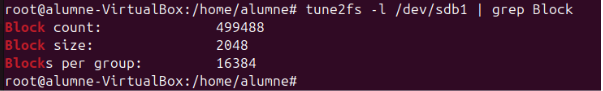

## Muntatge (temporal i definitiu)

primer fem un ls del directori base i seguidament creem una carpeta "particio1" amb un fitxer "hola"

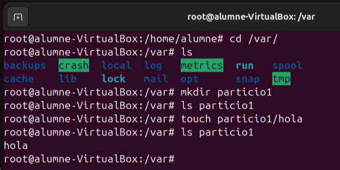

despres a montarem la particio1 real que hem creat molt anteriorment i si fem un ls vorem que ja no apareix el fitxer sino que s'ha montat la particio amb el seu fitxer "lost+found"

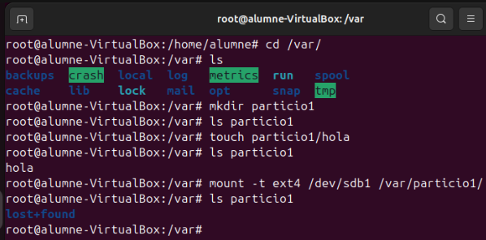

ignorant els fallos a la següent imatge fem un afegim amb touch un fitxer dins la particio1 i el mostrem amb ls

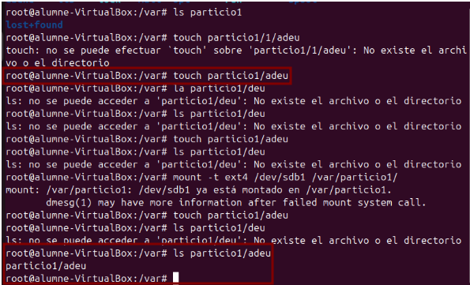

amb df -T mirem el sistema de fitxers de tot els sistemes muntats

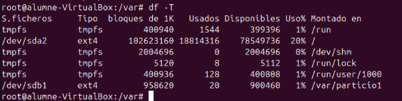

Al **fstab** podem veure diferents parametres per linis els quals nomes poden fer referancia a una **particio** o **carpeta**

- **/dev/sdb1**: Ubicació d'origen.
- **/var/particio1**: Ubicació d'estí.
- **ext4**: Sistema de fitxers.
- **defaults**: Opcions de muntatge.
- **0(dump)**: Aquesta columna indica si es farà una còpia de seguretat del sistema de fitxers amb la utilitat dump. (0 vol dir que no s'en fara cap).
- **0(fsck)**: Aquesta columna defineix l'ordre en què el sistema de fitxers serà comprovat amb fsck durant l'arrencada (0 que no es comprovará).

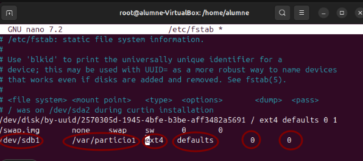

reiniciem la maquina i utilitzem df -T per a comprovar que s'ha muntat automaticament

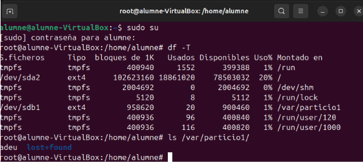

## Compartir carpetes

podem compartir amb dos sistemes (ubuntu i windows)

### **ubuntu(ext4)**

Per a compartir carpetes primer de tot tenim que installar el programari samba i el sambaclient

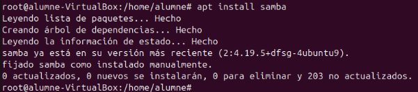

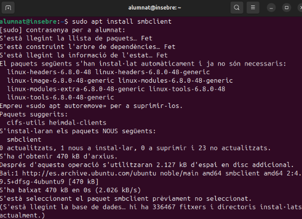

D'espres amb chmod i chown canviem els permisos i el propietari de la particio muntada

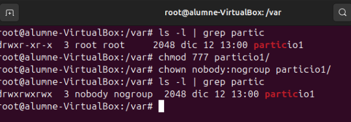

despres hi ha que configurar com es compartira la carpeta dins del smb.conf (en aquest cas nomes podra accedir-hi l'usuari "diego")

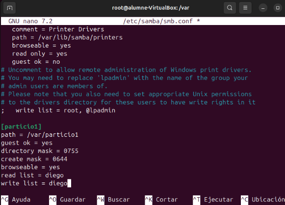

seguidament reiniciem el servei smbd nmbd

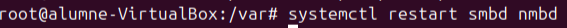

obviament ara necessitarem crear l'usuari diego per a poder accedir a la carpeta

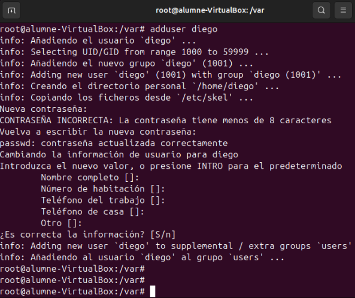

l'hi afegim una contrasenya de samba

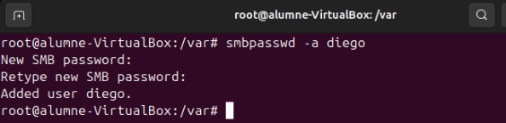

### **windows (ntfs)**

ara seguirem els mateixos passos per amb alguns canvis per a que funcione en ntfs

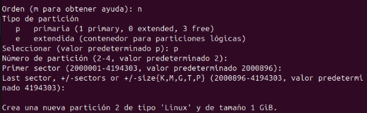

aqui si ens fixem afegirem de valor hex el numero 7 que fa referencia al formats compatibles amb ntfs...

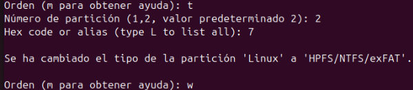

afegim el format amb ntfs

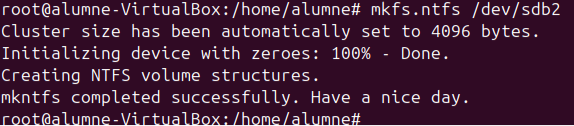

i afegim la carpeta particio2 on muntarem la particio

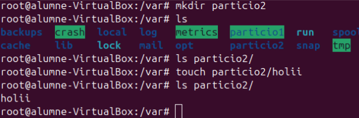

ens fara falta el seguent paquet per a puger montar la particio en ntfs

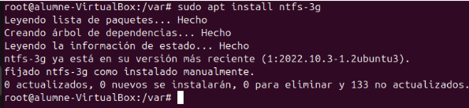

muntem temporalment i comprovem que funciona

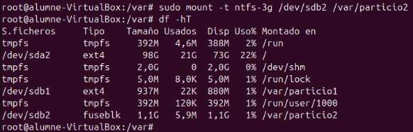

i configurem el muntatge automatic al fstab

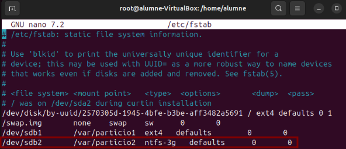

despres per a compartir-la configurem el samba amb permisos basics

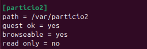

comprovem que podem accedir desde un windows i que podem crear fitxer que es guardin al linux

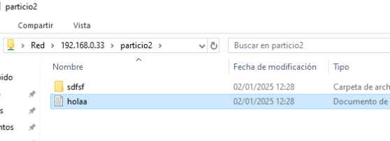

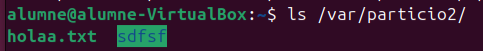

## Quotes de disc

primer de tot instalem el paquet de quota i el configurem el fstab

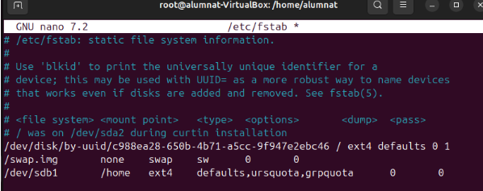

si al reiniciar no es mostren al fer un ls de la particio montada passem a crear-ho manualment

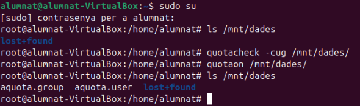

afegim un usuari

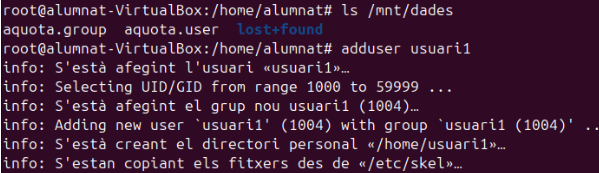

podem vore les quotes definides amb quota -u usuari1

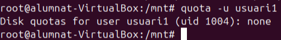

i editar-les amb "edquota -u"

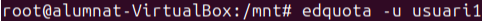

la configurem amb els seguents parametres

**Soft i Hard limit:**

    La quota soft limit és un límit flexible que permet a un usuari excedir temporalment l'espai en disc o el nombre d'inodes assignats. Quan se supera, comença un període de gràcia, durant el qual l'usuari pot continuar utilitzant espai extra abans d'imposar el hard limit, que és un límit estricte i inamovible. Aquest sistema facilita la gestió de recursos sense interrupcions immediates.

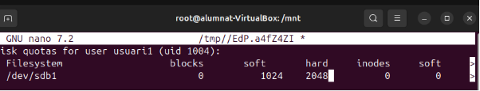

podem comprovar si s'ha aplicat amb "repquota"

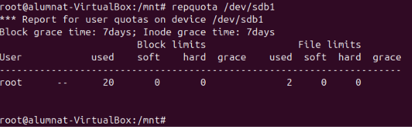

amb la seguent comanda podem generar fitxers per a comprovar que funcione la quota:

    dd if=/dev/zero of=test bs=1K count=800c

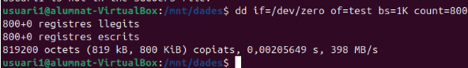

creem uns 3 fitxers per arribar al limit de la quota

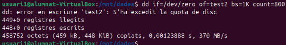

amb la seguent comanda podem editar el periode de gracia del soft limit: (ed quota -t)

    El **període de gràcia** és el temps que un usuari pot excedir el límit flexible (soft limit) d'espai en disc o inodes abans que el sistema li apliqui restriccions definitives. Durant aquest temps, l'usuari rep avisos però pot continuar treballant, sempre que no superi el hard limit. Si redueix l'ús per sota del soft limit abans que acabi el període, no s'apliquen sancions.

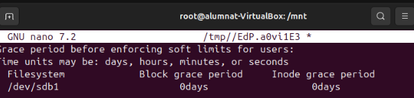

tambe podem intentar eccedir-lo per l'interficie grafica

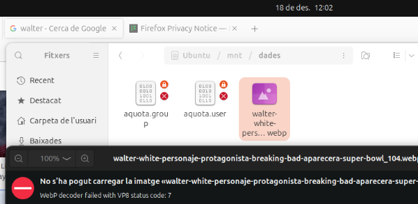