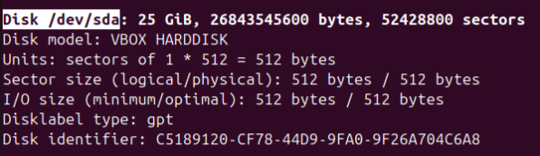
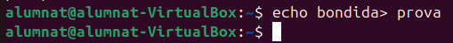
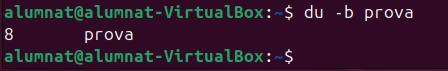
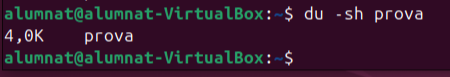
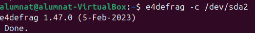

# Sistemes de fitxers i particions

**que es un sector?**

    Es la unitat minima fisica on es guarden les dades en un disco per defecte 512 i aquesta no es pot canviar mai.

**que es un block?**

    Un block es la unitat per defecte logica en la que un sistema operatiu treballa per a guardar dades.

*Estructura informació:*

1. **mida sector**: Els sectors són les unitats bàsiques d'emmagatzematge en un disc dur o SSD, amb una mida habitual de 512 bytes o 4096 bytes en discs moderns.

2. **mida block**: Les mides de bloc es refereixen a l'agregació de diversos sectors per formar una unitat més gran utilitzada pels sistemes de fitxers, habitualment en mides com 4 KB, 8 KB o més.

3. **fragmentació interna**: La fragmentació interna és tot aquell espai que queda desaprofitat en els blocs. Es pot reduir la mida del sector a 2048 en comptes de 4096. Pots arribar a perdre rendiment. De la mateixa manera, es poden dividir els blocs i reduir-los. També es poden fer més grans per guardar fitxers més pesants, amb el desavantatge que, si guardem fitxers petits, estarem desaprofitant molt d’espai.

4. **fragmentació externa**: Les dades emmagatzemades en blocs separats no continus poden dificultar l'accés seqüencial, reduint el rendiment del sistema.

*Tipus de formateig:*

1. **baix nivell**: Els processos de formateig físic defineixen la disposició de sectors i pistes en un dispositiu d'emmagatzematge, preparant-lo per rebre dades.

2. **mig nivell**: Els processos d'organització de blocs o particions creen subdivisions lògiques dins del dispositiu, com ara particions.

3. **alt nivell**: Les operacions que instal·len un sistema de fitxers sobre una partició per permetre l'emmagatzematge i gestió de fitxers, com NTFS, ext4 o FAT32.

## **Exemple Practic**

Primer comprovem si tenim algun disc extern afegit amb "fdisc -l"

ara provem de crear un fitxer i mirarem l'espai que ocupa

amb la comanda "du -b" podem vore l'espai que ocupa a nivell de fitxer

i amb "du -sh" veiem l'espai ocupat a nivell de block

**El problema de quan el sistema operatiu es va utilitzant, un arxiu no esta continu, sino que va agafant diferents blocs que no estan junts, llavors aixo perjudica el rendiment**

*amb la seguent comanda comprobem el nivell de fragmentacio d'un fitxer, directori o particio (en cas de vulguer desfragmentar llevem el -c)* e4defrag -c /dev/sd

