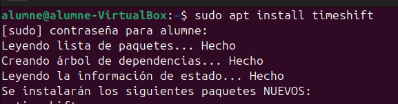
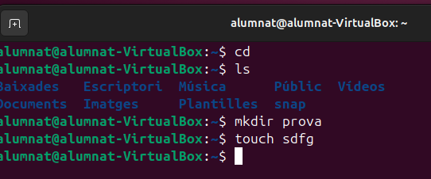
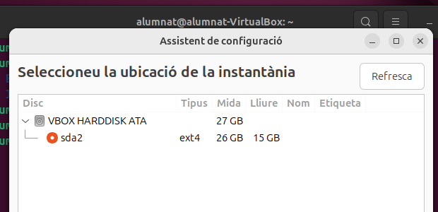
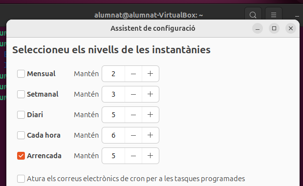
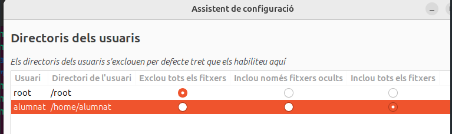
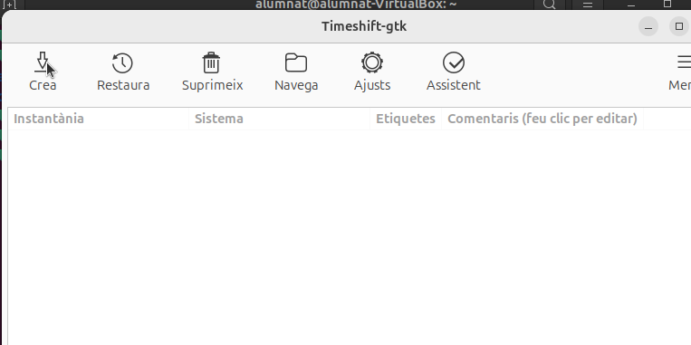
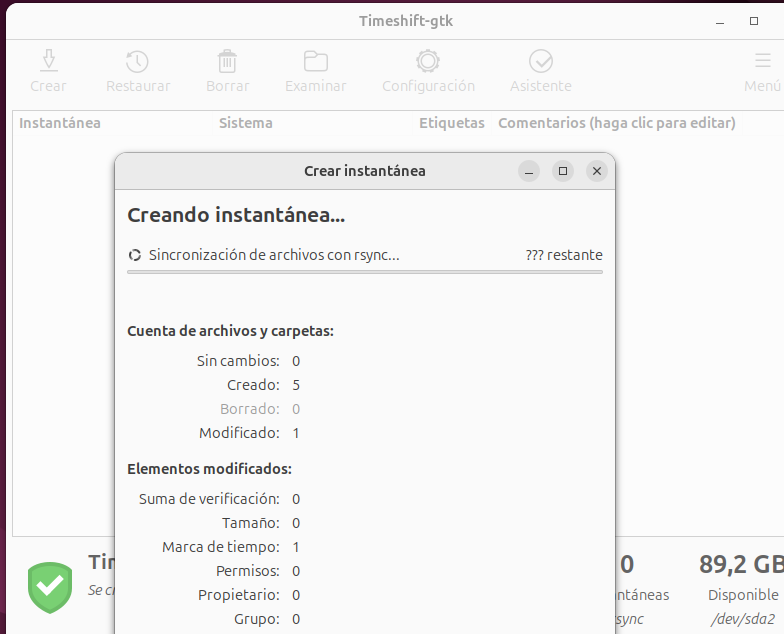
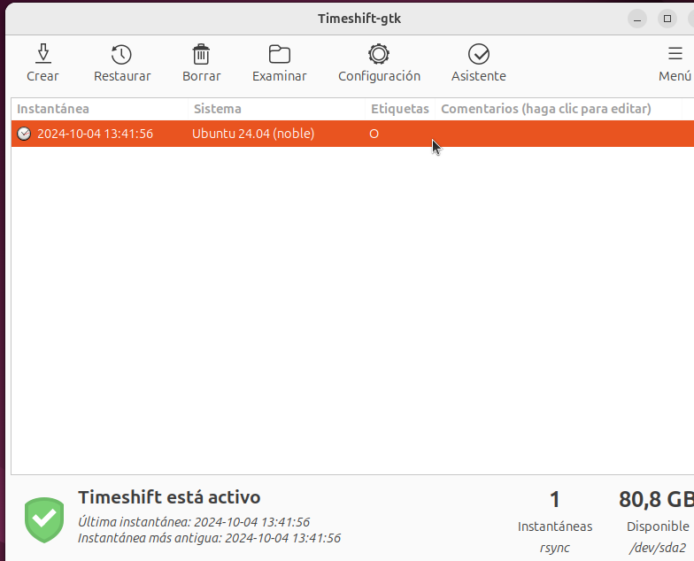

# Instal·lació TimeShift

**Que es el timeshift?**
Timeshift és una eina de programari de còpies de seguretat i restauració per a sistemes operatius Linux, dissenyada per a crear instantànies del sistema. Aquestes instantànies capturen l'estat del sistema en un moment específic, permetent als usuaris restaurar el seu sistema a un punt anterior si alguna cosa surt malament, com una actualització fallida o una configuració incorrecta.

Per a instalarlo obrim la terminal "sudo apt install timeshift"

Despres crearem una carpeta que contingue un fitxer

Quan obrim el programa anirem a configuració per a determinar la particio on es guardara l'instantanea

Aqui indiquem quan es fara l'instantanea

Aqui els directeris sel·lecionats s'exclouran de la copia

Ens mostrara disferents opcions entre elles utilitzarem la de "crear" per fer una copia de tots els fitxers de l'usuari

Ara començara amb la copia (pot trigar una bona estona)

Despres d'una estona ens mostrara la copia feta

